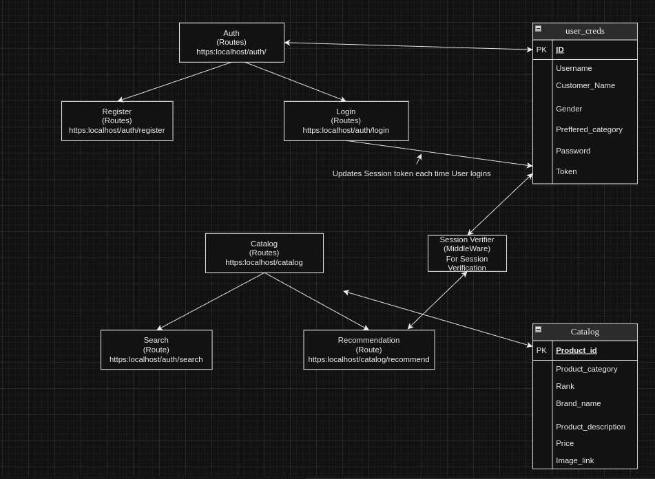

# Aman'sBeekpoke.ai Backend

Aman'sBeekpoke.ai Backend is a Node.js Express application with a CockroachDB database. It provides endpoints for user registration, login, search functionality, and recommendations.

## Architecture 


## Features

- User Registration
- User Login
- Search with optional parameters
- Recommendation (requires a bearer token in the Authorization header)

## Installation

1. Ensure Node.js is installed on your machine.
2. Clone the repository:

   ```bash
   git clone https://github.com/amansahani/aman-beespoke.git
   ```

3. Navigate to the project directory
    ```
    cd aman-beespoke
    ```
4. Make Sure that Node is installed, download it from official website.

5. Install Node dependencies
    ```
    npm install
    ```

6. Set up the database by running Prisma ORM migrations:
    ```
    npx prisma migrate dev
     ```

7. Create a .env file in the project root and add the following variables:
    ```
    DATABASE_URL=your-cockroachdb-url
    PRIVATE_KEY=your-private-key
    PORT=9001
    ```
8. Start the Application
    ```
    npm start
    ```
## Routes

1. Register

- Accepts parameters: [Username, Customer_name, Gender, Preferred_category (Optional), Password]

- URL: http://localhost:9001/auth/register

2. Login

- Accepts parameters: [Username, Password]
- URL: http://localhost:9001/auth/login

3. Search

- Accepts parameters: search (JSON with child parameters - keywords, minPrice (Optional), maxPrice (Optional))
- URL: http://localhost:9001/catalog/search

4. Recommendation

- Accepts parameter: Bearer token in Authorization header
- URL: http://localhost:9001/catalog/recommend

## Security

- This project uses JWT for session tokens and bcrypt for password encryption. The default algorithm for jwt is  bcrypt.hash, and for jwt session token is H256 algorithm.